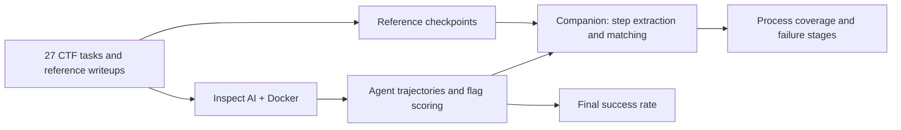

# AIS3 LLM Security Evaluation

### Writeup-based analysis of language-model CTF solving

**[Best Project Award · AI Track · AIS3 2026](RECOGNITION.md)**

[](https://github.com/Sean-Hawks/ais3-llm-seceval/actions/workflows/ci.yml)

**What can a failed CTF attempt tell us about an agent's capabilities?** We study final outcomes alongside the intermediate steps recorded in actual solution trajectories.

English · [繁體中文](README.zh-TW.md) · [Documentation](docs/README.md) · [Results](results/README.md) · [Task catalog](results/TASK_CATALOG.md) · [Research brief](docs/en/RESEARCH_BRIEF.md) · [Claim–evidence ledger](docs/en/CLAIMS.md)

We present a small, auditable research artifact for studying LLM agents on cybersecurity tasks. **Bench27** contains 27 CTF challenges across six categories, six evaluated model labels, and five planned attempts per task. The released snapshot contains **803 valid attempts**, reconciled against 30 local raw logs. The project combines an Inspect AI execution harness, reference checkpoints, and a companion pipeline for comparing recorded solution steps. Final flag correctness and intermediate progress remain separate outcomes.

The contribution is an inspectable implementation and case-study dataset for **post-hoc trajectory analysis**. It builds on existing interactive and subtask-based evaluations; it does not claim to introduce intermediate-step evaluation itself. In particular, [Cybench already evaluates intermediary subtasks](https://arxiv.org/abs/2408.08926).

This repository contains the benchmark, Inspect AI harness, trajectories and result snapshot. The [companion step-analysis repository](https://github.com/YuCheng1122/ais-final) contains structured extraction, anchor matching and exploratory embedding similarity. See the [integration guide](docs/en/COMPANION.md).



## Contributions and evidence

| Contribution | Inspectable artifact | Scope |
|---|---|---|
| A bounded CTF evaluation corpus | [27-task catalog](results/TASK_CATALOG.md), task files and reference checkpoints | Curated public tasks; not a contamination-free test set |
| Auditable execution outcomes | [Results](results/README.md), [raw-log audit](ctf/bench27/snapshot_audit.json), standardized new-run settings | 803 retained attempts; original scores preserved |
| A process-analysis interface | [Worked example](docs/en/RESEARCH_BRIEF.md#worked-example), [companion integration](docs/en/COMPANION.md) | Reference steps, literal evidence and semantic similarity remain distinct |
| Reproducibility tooling | Offline validation, audited export, tests and CI | Verifies the published snapshot; end-to-end container reruns are a separate validation level |

**Suggested reading:** [research brief](docs/en/RESEARCH_BRIEF.md) → [results](results/README.md) → [claim–evidence ledger](docs/en/CLAIMS.md) → [methodology](docs/en/METHODOLOGY.md). The ledger explicitly lists unresolved claims and the evidence needed to test them.

## At a glance

- **Questions:** Which categories can models solve? How do older and 2026 tasks differ? What useful progress appears in failed attempts?
- **Scale:** 27 tasks × 6 models × 5 planned attempts = 810; the committed snapshot contains 803 valid attempts.
- **Tasks:** 12 older public tasks, 12 tasks from 2026, and 3 difficult case studies across crypto, rev, forensics, misc, web and pwn.
- **Signals:** Scorer success, flags appearing in trajectories, reference-step coverage and exploratory semantic similarity remain separate.
- **Limits:** A temporal gap does not establish training contamination, and new public tasks are not guaranteed unseen. Category distributions are not identical; difficulty has not been calibrated.

## Descriptive outcome snapshot


Left: tasks solved at least once over available repetitions. Right: successful / valid attempts for the older and 2026 cohorts. The cohorts differ in composition and scorer, so these are descriptive outcomes. [Exact values and figure reproduction](results/figures/README.md).

## Start offline: no API, Docker or extra dependencies

Use Python 3.10+ from the repository root:

```bash
python3 -m ais3_bench validate
python3 -m ais3_bench report
python3 -m unittest discover -s tests -v
```

Read the [generated results](results/README.md), [27-task catalog](results/TASK_CATALOG.md) and [methodology](docs/en/METHODOLOGY.md). These commands make no model calls and leave historical result JSON unchanged.

| Model (historical experiment label) | Tasks solved at least once |
|---|---:|
| nemotron-3-ultra-550b | 15 / 27 |
| gemma-4-26b | 14 / 27 |
| gemma-4-12b | 12 / 27 |
| nemotron-cascade-2-30b | 10 / 27 |
| llama-3.3-70b | 7 / 27 |
| llama-3.1-8b | 4 / 27 |

This is observed coverage over up to five valid attempts, **not single-attempt accuracy**. [Full results](results/README.md) include per-attempt denominators, temporal differences and source hashes.

The frontier reference uses a different scaffold and is reported separately. Current data show 27/27 tasks and 119/131 successful attempts; slides 22 and 34 show 26/27. Version and scoring reconciliation remain open. Model names retain experiment labels; vendor identity, exact revisions and training cutoffs have not been independently established.

## Run your own experiment

Follow the [setup guide](docs/en/SETUP.md) and configure your endpoint. Model calls may incur provider charges.

```bash
python3 -m venv .venv
source .venv/bin/activate
python -m pip install -r requirements.txt
cp .env.example .env
# Edit .env, then check local capabilities
python -m ais3_bench doctor --evaluation

# Preview recent2026 for one model; no API calls
python -m ais3_bench run --arm recent2026 --model 8b
# Execute when ready
python -m ais3_bench run --arm recent2026 --model 8b --execute
```

[configs/bench27.json](configs/bench27.json) centralizes defaults: 5 epochs, a 50-message limit, 1800 seconds, 32768 maximum tool-output length and disabled parallel tool calls. **A message limit is not a count of tool commands.** New runs go to `output/runs/`, leaving the published snapshot intact. Read the setup guide for upstream sandbox requirements.

## Repository map

| Location | Purpose | Audience |
|---|---|---|
| [docs/](docs/README.md) | Bilingual setup, methodology, data dictionary, evidence gaps and integration | Everyone |
| [results/](results/README.md) | Rebuildable reports, machine-readable summary, task catalog | Reviewers / researchers |
| [ais3_bench/](ais3_bench/) | Offline validation, reports, execution plans and audited export | Developers |
| [configs/](configs/bench27.json) | Shared experiment configuration | Experimenters |
| [ctf/bench27/](ctf/bench27/README.md) | Primary tasks, historical JSON, references and trajectories | Researchers |
| [tests/](tests/) | Regression checks for data, scoring, extraction and configuration | Contributors |
| [docs/history/](docs/history/README.md) | Earlier environment notes, operating manual and slides | Historical reference |
| [ctf/_archive_20260726/](ctf/_archive_20260726/README.md) | Earlier Bench25 and synthetic tasks | Historical reference |

Challenge and historical analysis paths remain stable for research citations. The former root `skills.md` and environment slides now live under `docs/history/`. The legacy dashboard, cost tables and `agent_wp/` are historical artifacts; `results/` is the maintained reporting entry point. Legacy dashboard status is not a live experiment monitor.

## Citation and recognition

Please cite this **software artifact** with the commit or release you used. [CITATION.cff](CITATION.cff) enables GitHub's citation menu; [CITATION.bib](CITATION.bib) provides BibTeX. No paper DOI or peer-reviewed publication is claimed. Team members are credited in [AUTHORS.md](AUTHORS.md); the award record is documented separately in [RECOGNITION.md](RECOGNITION.md).

## Open-source status

Core bilingual documentation, offline analysis, a unified runner and CI are provided. Reproducing the presentation's step heatmaps still requires an agreed experiment revision, step-score outputs and extraction records across both repositories. See [evidence gaps](docs/en/EVIDENCE_GAPS.md) and the [improvement report](docs/en/REPO_IMPROVEMENTS.md). This update does not claim a complete rerun of all models or Docker challenges.

See [CONTRIBUTING.md](CONTRIBUTING.md), [SECURITY.md](SECURITY.md) and [CITATION.cff](CITATION.cff).

Original harness, methodology and documentation use the [MIT license](LICENSE). Third-party challenge assets and reference material retain their upstream terms; see [THIRD_PARTY_NOTICES.md](THIRD_PARTY_NOTICES.md). Public availability does not automatically imply MIT permission.
