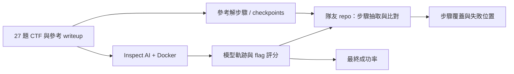
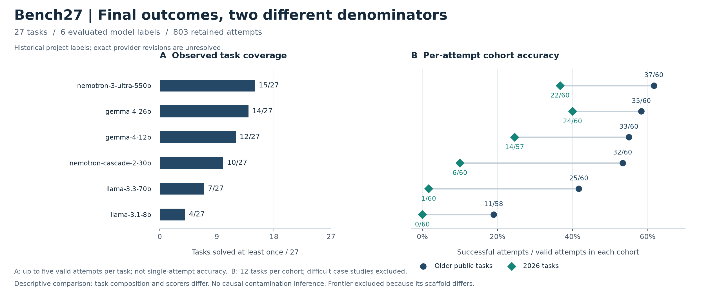

# AIS3 LLM Security Evaluation

### 基於 writeup 步驟分解的語言模型 CTF 解題分析

**[AIS3 2026 AI 組最佳專題](RECOGNITION.md)**

[](https://github.com/Sean-Hawks/ais3-llm-seceval/actions/workflows/ci.yml)

**一次沒解出 flag 的嘗試，能透露哪些模型能力？** 我們把最終結果與實際軌跡中的中間步驟分開分析。

[English](README.md) · 繁體中文 · [文件導覽](docs/README.md) · [結果](results/README.zh-TW.md) · [題目索引](results/TASK_CATALOG.md) · [研究摘要](docs/zh-TW/RESEARCH_BRIEF.md) · [主張與證據](docs/zh-TW/CLAIMS.md)

AIS3 2026 AI2 組專題「語言模型資安能力評量的方法設計」。**Bench27** 包含六類共 27 題 CTF、六個受測模型標籤與每題五次規劃嘗試；公開結果有 **803 筆有效樣本**，已與本機 30 份原始 logs 核對。我們提供 Inspect AI 執行框架、參考 checkpoints 與隊友的解題步驟比對流程，分別呈現最終 flag 正確性與中間進展。

本專題的貢獻是可檢視的實作、案例資料及**事後解題軌跡分析**。這項工作建立在既有互動式與子任務評估之上；[Cybench 本身已包含中間子任務評估](https://arxiv.org/abs/2408.08926)，因此不把「首次評估中間步驟」當成本專題的創新主張。

此 repo 提供題組、Inspect AI 評測、解題軌跡與結果快照；[隊友的步驟分析 repo](https://github.com/YuCheng1122/ais-final) 提供結構化步驟抽取、anchor 比對與探索性的語意相似度。[兩者如何串接](docs/zh-TW/COMPANION.md)。



## 研究貢獻與證據

| 貢獻 | 可檢視成果 | 適用範圍 |
|---|---|---|
| 範圍明確的 CTF 評測資料 | [27 題索引](results/TASK_CATALOG.md)、題檔與 checkpoints | 精選公開題，未宣稱完全無訓練暴露 |
| 可追溯的實驗結果 | [結果表](results/README.zh-TW.md)、[原始紀錄稽核](ctf/bench27/snapshot_audit.json)、新實驗設定 | 803 次保留樣本，原始評分未改寫 |
| 解題過程分析介面 | [具體案例](docs/zh-TW/RESEARCH_BRIEF.md)、[雙 repo 串接](docs/zh-TW/COMPANION.md) | 區分參考步驟、文字證據與語意相似度 |
| 可重現性工具 | 離線驗證、帶 audit 的匯出、測試與 CI | 能核對公開快照；容器完整重跑是另一層驗證 |

建議依序閱讀：[研究摘要](docs/zh-TW/RESEARCH_BRIEF.md) → [結果](results/README.zh-TW.md) → [主張與證據](docs/zh-TW/CLAIMS.md) → [方法](docs/zh-TW/METHODOLOGY.md)。

## 三分鐘看懂

- **研究問題**：不同模型在哪些類別表現較好？新舊題的結果有何差異？失敗模型已完成了哪些有效步驟？
- **規模**：27 題、6 個模型、每題規劃 5 次，共 810 次；已提交結果含 803 筆有效樣本。
- **題組**：12 題較早公開題、12 題 2026 題、3 題困難案例；涵蓋 crypto、rev、forensics、misc、web、pwn。
- **訊號**：最終 scorer 成功、軌跡中的 flag、參考步驟覆蓋、探索性語意相似度分開解讀。
- **證據邊界**：年份差距不等於已證明訓練污染；公開新題也不能保證未見過。兩組題型分布不完全對稱，難度尚未校準。

## 描述性結果總覽



左：可用重複中至少一次解出的題數。右：新舊分區的成功次數／有效次數。兩組題目分布與 scorer 不同，因此僅作描述性解讀。[精確數值與圖表重建](results/figures/README.md)。

## 不需要 API、Docker 或額外套件的開始方式

從 repo 根目錄使用 Python 3.10 以上：

```bash
python3 -m ais3_bench validate
python3 -m ais3_bench report
python3 -m unittest discover -s tests -v
```

接著閱讀 [自動重建的結果表](results/README.zh-TW.md)、[27 題索引](results/TASK_CATALOG.md) 和 [方法與限制](docs/zh-TW/METHODOLOGY.md)。所有指令在本機執行；不會呼叫模型或改動歷史結果 JSON。

| 模型（歷史實驗名稱） | 至少一次成功的題數 |
|---|---:|
| nemotron-3-ultra-550b | 15 / 27 |
| gemma-4-26b | 14 / 27 |
| gemma-4-12b | 12 / 27 |
| nemotron-cascade-2-30b | 10 / 27 |
| llama-3.3-70b | 7 / 27 |
| llama-3.1-8b | 4 / 27 |

這是最多五次有效嘗試的觀察覆蓋率，**不是單次成功率**。每次嘗試的分子、分母、年份差距與來源雜湊見 [完整結果](results/README.zh-TW.md)。

Frontier 參考使用不同 scaffold，另列於結果頁。目前資料是 27/27 題、119/131 次；簡報第 22、34 頁是 26/27，仍待核對版本與評分口徑。此處的模型名稱保留原實驗標籤，不代表已獨立確認供應商的版本或訓練截止日。

## 跑自己的實驗

先依 [安裝與操作指南](docs/zh-TW/SETUP.md) 設定環境及自己的 endpoint。API 呼叫可能產生費用。

```bash
python3 -m venv .venv
source .venv/bin/activate
python -m pip install -r requirements.txt
cp .env.example .env
# 編輯 .env 後，先確認本機環境
python -m ais3_bench doctor --evaluation

# 預覽 recent2026 × 一個模型的完整設定；不呼叫 API
python -m ais3_bench run --arm recent2026 --model 8b
# 準備完成才實際執行
python -m ais3_bench run --arm recent2026 --model 8b --execute
```

所有主要設定集中在 [configs/bench27.json](configs/bench27.json)。預設 5 epochs、50 則訊息上限、1800 秒、工具輸出上限 32768、關閉平行工具呼叫。**訊息上限不等於 50 次工具指令**。新實驗寫入 `output/runs/`，不覆蓋已發表快照。完整題組與上游 sandbox 的需求請先看操作指南。

## 檔案地圖

| 位置 | 用途 | 建議讀者 |
|---|---|---|
| [docs/](docs/README.md) | 中英雙語方法、設定、資料字典、缺口與串接 | 所有人 |
| [results/](results/README.zh-TW.md) | 可重建的結果、機器可讀摘要、題目索引 | 審閱者／研究者 |
| [ais3_bench/](ais3_bench/) | 離線驗證、報告、執行計畫、帶稽核紀錄的匯出 | 開發者 |
| [configs/](configs/bench27.json) | 統一實驗設定 | 重現實驗者 |
| [ctf/bench27/](ctf/bench27/README.md) | 主題組、歷史結果 JSON、參考解與模型軌跡 | 研究者 |
| [tests/](tests/) | 結果、評分、資料抽取、設定的回歸測試 | 貢獻者 |
| [docs/history/](docs/history/README.md) | 舊環境筆記、操作手冊與投影片 | 追溯歷史 |
| [ctf/_archive_20260726/](ctf/_archive_20260726/README.md) | 早期 Bench25／自製題組 | 追溯歷史 |

題目與舊分析工具保留原路徑，避免破壞既有研究引用。根目錄的舊 `skills.md` 與環境簡報已歸入 `docs/history/`。`ctf/bench27/dashboard.html`、成本表與 `agent_wp/` 為歷史研究產物；新的正式入口是 `results/`，不要把舊儀表板的狀態當成正在執行的實驗。

## 引用與獲獎

引用此**研究軟體**時，請附所使用的 commit 或 release。[CITATION.cff](CITATION.cff) 支援 GitHub 引用功能，另提供 [BibTeX](CITATION.bib)。不虛設論文 DOI 或同儕審查紀錄。成員見 [AUTHORS.md](AUTHORS.md)，獎項來源見 [RECOGNITION.md](RECOGNITION.md)。

## 開源狀態與下一步

主要說明、離線分析、統一執行入口與 CI 已整理。完整重現簡報的步驟熱圖，仍需釘選兩個 repo 的實驗版本、逐步評分輸出與抽取紀錄；詳見 [根據簡報整理的待補資料](docs/zh-TW/EVIDENCE_GAPS.md) 和 [改善紀錄](docs/zh-TW/REPO_IMPROVEMENTS.md)。目前不宣稱已完成所有模型與所有 Docker 題目的重新實測。

歡迎依 [CONTRIBUTING.md](CONTRIBUTING.md) 貢獻；執行與回報問題前請讀 [SECURITY.md](SECURITY.md)。引用方式見 [CITATION.cff](CITATION.cff)。

原創 harness、方法設計與文件依 [MIT](LICENSE) 授權；第三方題檔與參考解依各自條款，見 [THIRD_PARTY_NOTICES.md](THIRD_PARTY_NOTICES.md)。公開可下載不等於自動取得 MIT 授權。本 repo 不把第三方材料重新授權。
